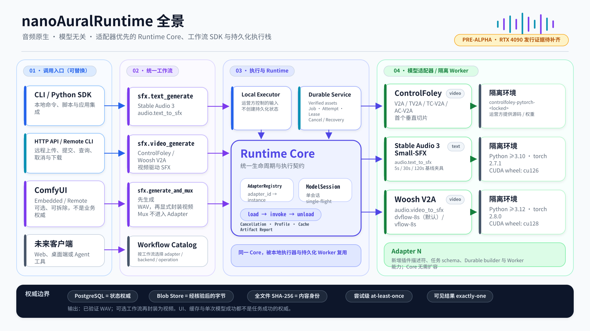
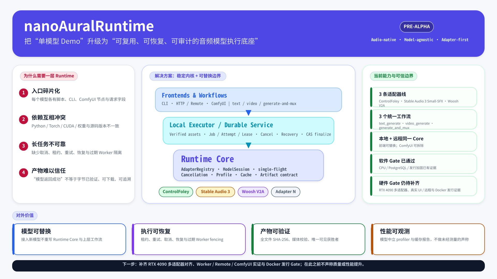

# nanoAuralRuntime

nanoAuralRuntime 是一套音频原生、模型无关的 Runtime Core、适配器 SDK 与持久化服务栈。ControlFoley 是首个垂直工作流；当前生产适配器还包括 Stable Audio 3 Small-SFX（`audio.text_to_sfx`）与 Woosh V2A（`audio.video_to_sfx`）。单一模型或 UI 框架不是系统边界。

状态：活跃的 pre-alpha。软件/CPU 阶段已实现，但**不是**已完成的发行。所需的 RTX 4090 对齐、基准、Worker、远程与 UI 证据仍为 **延期（DEFERRED）**，并阻塞发行。不得根据跳过的测试声称对齐、质量、加速或性能。

## 项目全景

[](docs/diagrams/system-overview.svg)

这张图从 CLI / HTTP / ComfyUI 等入口开始，串联统一 SFX 工作流、Local Executor / Durable Service、Runtime Core、模型适配器与隔离 Worker 环境，并标出状态与字节的权威边界。

- [可编辑的系统全景 Excalidraw](docs/diagrams/system-overview.excalidraw)
- [Runtime Core 核心架构图](docs/diagrams/runtime-core.svg) · [Excalidraw 源文件](docs/diagrams/runtime-core.excalidraw)
- [可靠远程执行图](docs/diagrams/durable-execution.svg) · [Excalidraw 源文件](docs/diagrams/durable-execution.excalidraw)
- [对外汇报单页](docs/diagrams/executive-one-pager.svg) · [Excalidraw 源文件](docs/diagrams/executive-one-pager.excalidraw)
- [全部图表、用途与维护约定](docs/diagrams/README.md)

## 对外汇报图

[](docs/diagrams/executive-one-pager.svg)

## 架构与权威

依赖方向固定向下：

```text
Frontend -> Workflow -> Durable Service / Local Executor
         -> Runtime Core -> Model Adapter -> Original Model Backend
```

Runtime Core 不依赖 ControlFoley、PostgreSQL、存储、API 或 ComfyUI。ComfyUI 是可选、可拆除的前端；持久化数据库仍是资产、任务、尝试与产物状态的权威。

权威文档：

- [项目章程](PROJECT_CHARTER.md)
- [架构](ARCHITECTURE.md)
- [路线图](ROADMAP.md)
- [阶段状态与 Gate](plans/STATUS.md)
- [ADR 0003：隔离的 Worker 环境](docs/decisions/0003-model-specific-worker-environments.md)
- [ADR 0004：适配器插件与 Worker 路由](docs/decisions/0004-adapter-plugin-and-worker-routing.md)

## 安装经审计的开发产物

使用钉死的 setuptools 82.0.1 离线构建无头 Python 产物。该命令会创建隔离的源码快照，只接受已声明的八个 Python 包树与五份迁移资源，审计每一个 wheel / sdist 成员，拒绝覆盖，并报告产物 SHA-256。

```sh
mkdir -p dist
python tools/release_artifacts.py --output-dir dist
python -m pip install --no-index --no-deps \
  dist/nano_aural_runtime-0.1.0.dev0-py3-none-any.whl
```

基础发行包没有强制第三方依赖。PostgreSQL 运行时支持是显式的 `durable-postgres` extra；测试与开发依赖保持分离。

```sh
python -m pip install '.[durable-postgres]'
python -m pip install -e '.[dev,postgres-test]'
```

ControlFoley 源码、依赖、权重、checkpoint、夹具与缓存均为运营方提供的外部材料。任何 extra 都不会安装它们，也不会打进 wheel、sdist 或参考容器。官方 ControlFoley 仓库将源码标识为 [Apache-2.0](https://github.com/xiaomi-research/controlfoley)，官方模型卡将权重标识为 [CC BY-NC 4.0](https://huggingface.co/YJX-Xiaomi/ControlFoley/blob/main/README.md)，含非商业限制。本项目不授予这些外部材料的任何权利。运营方必须在钉死的源码修订与获取/使用时的模型卡条款上自行核验许可；见 [NOTICE](NOTICE)。Stable Audio 3 Small-SFX 与 Woosh V2A 权重同样是运营方提供、受门控或 CC BY-NC 约束的材料，不在 wheel 中。见 [第二适配器许可边界](docs/second-adapter-license-boundary.md)。

## 无头命令

下列帮助必须在没有模型权重、API 凭据、PostgreSQL 或网络的情况下可用：

```sh
nano-aural --help
nano-aural-controlfoley --help
nano-aural-remote --help
python -m nano_aural_runtime_cli --help
python -m nano_aural_runtime_remote --help
python -m nano_aural_runtime.durable.service --help
python -m nano_aural_runtime.durable.reference_worker --help
python -m nano_aural_runtime.durable.recovery --help
```

`nano-aural controlfoley local` 是本地、由运营方控制的路径。`nano-aural-remote` 与公开的持久化 API 交换已验证的资产、任务与产物标识。在提供部署或服务配置前，请阅读命令帮助与 [持久化运维指南](docs/durable-operations.md)。

## 持久化参考环境边界

`compose.yaml` 与 `ops/Dockerfile.api` 是 CPU 假发布参考环境。镜像只复制 `nano_aural_runtime`，以非 root 用户运行，使用挂载的密钥文件，并排除 ControlFoley、torch、CUDA、权重与 ComfyUI。参考构建明确为 `linux/amd64`；其 Python 基础镜像使用 tag 加 digest，解析后的 Python 依赖使用精确 wheel 哈希且仅安装二进制包。其标准库 WSGI 服务器不是生产 HTTP/TLS 服务器。生产暴露需要独立支持的反向代理/服务器、TLS、请求超时、并发限制与运维安全审查。

Docker daemon 验证取决于环境：没有容器 CLI/daemon 时保持未跑。惰性的 `gpu-deferred` profile 不是 GPU Worker，不能满足硬件 Gate。

## 发行与安全

- [发行就绪与产物契约](docs/release-readiness.md)
- [ComfyUI 兼容与拆除](docs/comfyui-compatibility-removal.md)
- [变更日志](CHANGELOG.md)
- [安全策略](SECURITY.md)
- [许可证](LICENSE) 与 [声明](NOTICE)

发行产物不得包含权重、媒体、缓存、密钥、私有路径、生成证据或归档研究。安全问题请通过 `SECURITY.md` 中的私有流程报告，切勿在公开 issue 中放入凭据或私有部署细节。
