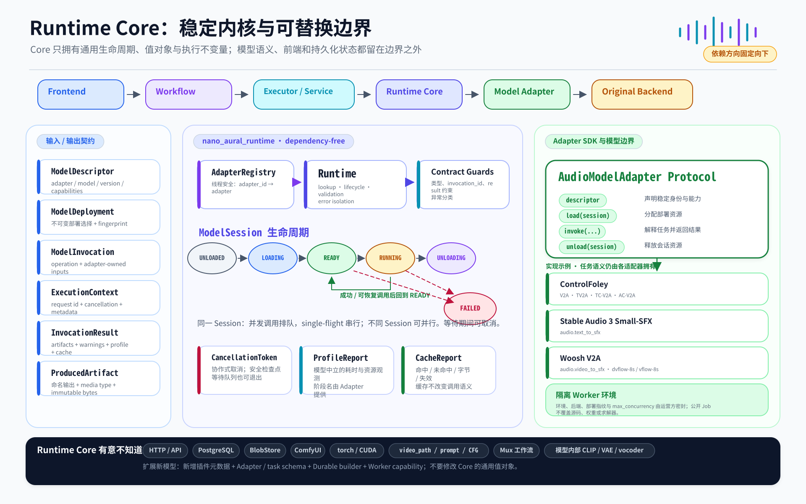
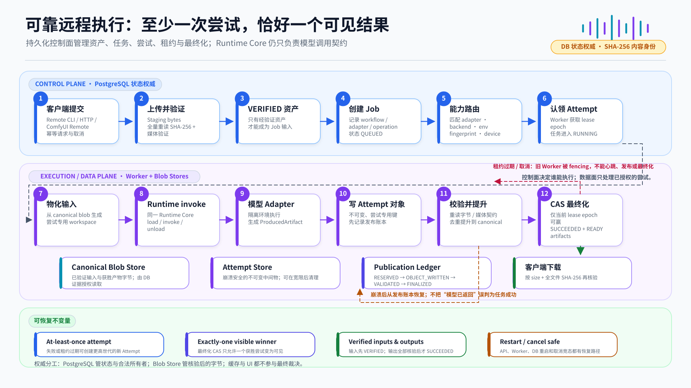

# nanoAuralRuntime 架构图与汇报图

本目录保存 nanoAuralRuntime 的可编辑 Excalidraw 源文件与 GitHub 可直接预览的 SVG 导出。图表依据当前的项目章程、架构文档、统一 SFX 工作流、Worker 环境 ADR 和执行状态绘制；它们用于解释系统边界，不替代权威文档、测试结果或硬件 Gate 证据。

## 图表索引

| 图表 | 适用场景 | SVG 预览 | 可编辑源文件 |
| --- | --- | --- | --- |
| 系统全景 | README、项目介绍、技术交流；从入口到模型 Worker 的端到端视图 | [system-overview.svg](system-overview.svg) | [system-overview.excalidraw](system-overview.excalidraw) |
| Runtime Core 核心架构 | 研发评审、Adapter 接入、依赖边界说明 | [runtime-core.svg](runtime-core.svg) | [runtime-core.excalidraw](runtime-core.excalidraw) |
| 可靠远程执行 | 服务端方案评审、任务恢复、发布与一致性说明 | [durable-execution.svg](durable-execution.svg) | [durable-execution.excalidraw](durable-execution.excalidraw) |
| 对外汇报单页 | 对外演示、阶段汇报、项目路演；问题—方案—能力—价值 | [executive-one-pager.svg](executive-one-pager.svg) | [executive-one-pager.excalidraw](executive-one-pager.excalidraw) |

## 系统全景

展示四层主路径：调用入口、统一工作流、执行与 Runtime、模型适配器与隔离 Worker。底部单独标出 PostgreSQL、Blob Store、全文件 SHA-256、尝试级至少一次与可见结果恰好一次的权威边界。

## Runtime Core 核心架构

聚焦 Runtime Core 的通用值对象、`AdapterRegistry`、`Runtime`、`ModelSession` 生命周期、single-flight 语义、取消、profiling、缓存报告以及 `AudioModelAdapter` 边界，并明确列出 Core 有意不知道的系统概念。

## 可靠远程执行

描述从客户端提交、上传验证、能力路由、Attempt 认领，到 Runtime 调用、尝试对象写入、产物校验提升与 CAS 最终化的完整路径。图中的成功语义是“所有必需产物已验证并绑定到唯一获胜尝试”，不是“模型调用已经返回”。

## 对外汇报单页

适合在一页内说明项目解决的问题、分层方案、当前三条适配器线、可信状态边界和对外价值。图中明确保留 pre-alpha 状态，以及 RTX 4090、真实 Worker / Remote / ComfyUI 与 Docker 发行证据仍待补齐的边界。

## 编辑与导出约定

1. 使用 Excalidraw 打开同名 `.excalidraw` 文件进行修改。
2. 修改后同步导出同名 SVG，保持 README 与文档中的链接不变。
3. 不在图中加入未经测量的质量、性能或加速结论；延期的硬件验证必须继续标记为延期，而不是通过。
4. 结构性变更应先更新 `PROJECT_CHARTER.md`、`ARCHITECTURE.md`、相关 ADR 或 `ROADMAP.md`，再同步图表。

## 权威参考

- [项目章程](../../PROJECT_CHARTER.md)
- [架构](../../ARCHITECTURE.md)
- [执行状态与 Gate](../../plans/STATUS.md)
- [统一 SFX 工作流](../sfx-workflows.md)
- [ADR 0003：隔离模型特定的 Worker 环境](../decisions/0003-model-specific-worker-environments.md)
- [ADR 0004：适配器插件发现与 Worker 路由](../decisions/0004-adapter-plugin-and-worker-routing.md)
- [持久化服务运维与恢复](../durable-operations.md)
